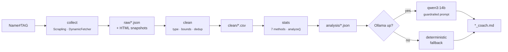

<div align="center">

# 🎯 VLCoach

### Evidence-based Valorant coaching from your own match history — no invented scores, no hidden uncertainty.

[](https://www.python.org/)
[](ROADMAP.md)
[](tests/)
[](https://ollama.com/)
[](https://github.com/obra/superpowers)

<br/>


<br/><br/>

**`vlcoach run "Name#TAG"`** → a coaching report where every claim carries a confidence interval, a sample size, and an *association ≠ causation* caveat.

</div>

---

## 💡 Why this exists

Stat sites give you raw aggregates. Self-coaching from them usually turns into a made-up formula like `0.4·K/D + 0.3·ACS + 0.3·winrate`. The weights are arbitrary and they hide how few games the numbers rest on.

VLCoach refuses to do that. Each statistical method answers **one** question, and uncertainty stays visible in the output. A 75% win rate from four games reads as *four games*.

A local LLM only phrases evidence that was already computed. It never sees raw HTML and it never invents a finding.

---

## 🔬 One question, one method

| Question | Method |
|---|---|
| How uncertain is my win rate? | **Wilson 95% interval** + Jeffreys Beta posterior |
| Is that 100% on Ascent real, or 3 games? | **Pseudo-count shrinkage** toward your overall rate, `k = 10` |
| Am I improving? | **EWMA**, `α = 0.20` |
| Was that match unusual *for me*? | **Median / MAD robust z-score** |
| Which metrics actually differ between my wins and losses? | **2,000-resample match-level bootstrap** — an effect is a `signal` only if the CI is clear of zero **and** larger than one MAD |
| Which combination is associated with winning? | **L2 logistic regression**, stratified CV AUC ± std, minimum 40 games |
| Is any of this causal? | **No.** The report says so, every time. |

Plus, after a statistics-and-coaching review: how many comparisons were made and how many false positives to expect, round margin in losses vs wins, consistency (MAD), your ACS rank inside your own team, and RR change when the page shows it.

---

## ⚙️ How it works



Every stage reads only the previous stage's file. Re-run `analyze` or `coach` without touching the network. Raw snapshots are written **before** parsing, so a selector fix never needs a re-crawl.

Six flat modules, four dependencies, everything else stdlib:

```
vlcoach/
  config.py    constants + the one FIELDS table (types, plausibility bounds)
  collect.py   the only module that touches the network
  clean.py     raw strings → typed rows; implausible → missing, never fabricated
  stats.py     wilson · jeffreys · shrink · robust_z · ewma · bootstrap_diff · logistic · analyze
  coach.py     Ollama client + bilingual fallback, same five sections either way
  cli.py       run · collect · analyze · coach
```

---

## 📋 The report

Five sections, always, in English or French (`--lang fr|en`):

1. **What the data actually says**
2. **What is probably noise / uncertain**
3. **Three coaching priorities**
4. **Next 10-game experiment**
5. **What extra data would unlock better coaching**

If Ollama is down, missing the model, or returns garbage, the deterministic fallback writes the same five sections from templates. The AI is optional; the statistics are not.

---

## 🚀 Quick start

<details>
<summary><b>Windows</b></summary>

```powershell
uv venv .venv --python 3.13
.\.venv\Scripts\Activate.ps1
uv pip install -e ".[dev]"
scrapling install                    # Playwright Chromium, obeys PLAYWRIGHT_BROWSERS_PATH
winget upgrade Ollama.Ollama         # needs >= 0.6.6 for qwen3
ollama pull qwen3:14b
pytest
```

Per-machine user env vars, not project config: `PLAYWRIGHT_BROWSERS_PATH`, `OLLAMA_MODELS`. Point them at a drive with room; the model is 9.3 GB.

</details>

<details>
<summary><b>macOS</b></summary>

```bash
uv venv .venv-mac --python 3.13
source .venv-mac/bin/activate
uv pip install -e ".[dev]"
scrapling install
brew install ollama && ollama pull qwen3:14b
pytest
```

</details>

### Usage

```bash
vlcoach run     "Name#TAG" --matches 50 --model auto --lang en   # full pipeline
vlcoach collect "Name#TAG" --matches 50 [--headed]               # scrape only
vlcoach analyze "Name#TAG"                                        # stats only, offline
vlcoach coach   "Name#TAG" --model auto --lang fr                 # report only, offline
```

Outputs land under `data/`:

```
data/raw/<stem>.json          every value as the page showed it, plus per-page HTML snapshots
data/clean/<stem>.csv         one typed row per match
data/analysis/<stem>.json     every interval, every sample size, the leakage warning
data/analysis/<stem>_coach.md the report
```

---

## 🧠 Local model

| | |
|---|---|
| Model | `qwen3:14b` — 9.3 GB, 40K context |
| Why | Thinking mode over structured JSON; French + English; fits 12 GB VRAM fully on-GPU |
| Rejected | `phi4:14b` (English-centric), `gemma3:12b` (weaker on numeric JSON), 24B-class (needs ~14 GB, forces CPU offload) |
| Measured | quantization, resident VRAM, tokens/s — recorded here once Task 11 runs |

No cloud key. Nothing leaves the machine.

---

## ⚠️ Access notice

`https://tracker.gg/robots.txt` disallows `/*/profile/*` and `/*/matches/*`, and Tracker Network states it does not permit scraping. This tool requests those pages anyway — for **your own public profile only**, with a real headless Chromium, a fixed 3-second delay, and no stealth, proxy, CAPTCHA or fingerprint logic of any kind. It stops on the first block and never retries harder. Use it on your own data and accept that access may end at any time.

Hard limits, enforced in code and in [`CLAUDE.md`](CLAUDE.md): `DynamicFetcher` only, fail closed, never fabricate a missing value, never infer a result the page did not state.

---

## 🗺️ Status

Built test-first, one module at a time, following the [Superpowers](https://github.com/obra/superpowers) workflow with [Ponytail](https://github.com/DietrichGebert/ponytail) keeping it minimal.

- [x] Environment, design spec, implementation plan
- [x] `config` — field table, Riot ID parsing
- [x] `stats` — Wilson, Jeffreys, shrinkage
- [ ] `stats` — robust z, EWMA, bootstrap, logistic, `analyze()`
- [ ] `clean`, `coach`, `cli`
- [ ] `collect` — live scraping against fixtures
- [ ] Ollama upgrade, model measurement
- [ ] Spec §12 verification

Full checklist: [`ROADMAP.md`](ROADMAP.md) · Log: [`HISTORY.md`](HISTORY.md) · Design: [`docs/superpowers/specs/`](docs/superpowers/specs/) · Plan: [`docs/superpowers/plans/`](docs/superpowers/plans/)

---

## 📐 What comes after v0.2

Match-level stats can find patterns, but the strongest coaching questions are round-level: opening duels, trades, 5v4 conversion, economy, post-plant decisions. That needs a lawful round-event source. Until one exists, adding heavier models would only manufacture false precision — so the roadmap stops here on purpose.

---

<div align="center">
<sub>Spec: <a href="SPECIFICATION.md">SPECIFICATION.md</a> · License: not yet chosen</sub>
</div>
